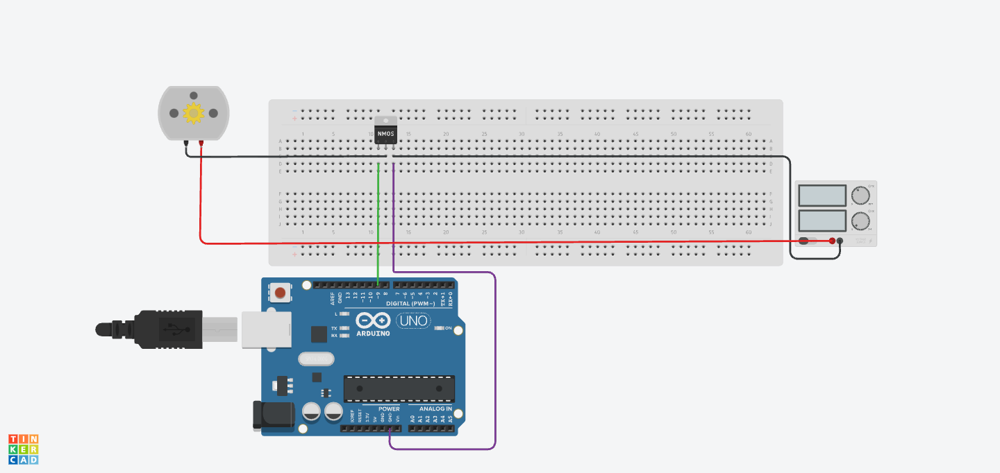
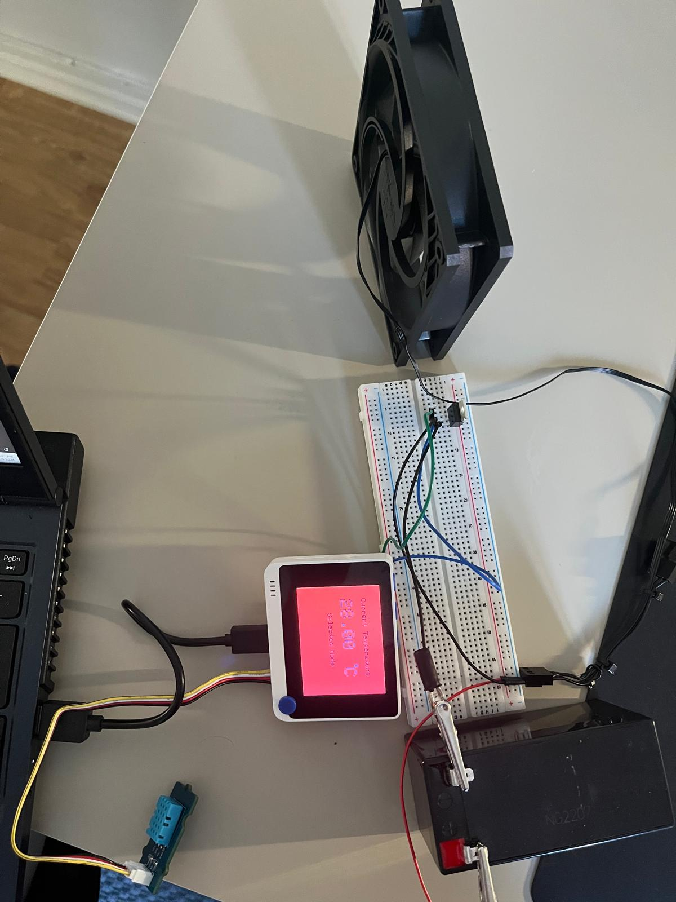

# IntelliBreeze

## Table of Content 

[[_TOC_]] 

## Introduction

Our product is a smart fan system that is capable of providing optimal comfort in various environments. Our product has the unique capability of adjusting the fan speed based on the surrounding temperature ensuring a pleasant atmosphere. With a user-friendly interface, it allows the user to remotely customise, based on their preferences, the temperature measurement units, preferred fan speed, and preferred temperature.

The sensors attached to our smart fan provide temperature and energy consumption analytics to the user through our pocket-friendly app. Additionally, the system will notify the user upon any adjustments in the fan speed. Together, this allows the user to stay informed about their environment and the state of the fan, promoting control over their usage.

## Dependencies & Requirements

Here are a couple of things that you will need before moving on to the **Installation Guide** of IntelliBreeze.

- [Wio Terminal from Seeed Studio](https://www.seeedstudio.com/Wio-Terminal-p-4509.html)
- [Arduino IDE](https://www.arduino.cc/en/software)
- Wio Terminal Grove Sensors (The list of sensors can be found in the Wiki)
- Other hardware components as listed below

#### **Required Components**

1. **`MOSFET Transistor`**
   - `IRF530N` (or any n-channel MOSFET)
     - The MOSFET is an essential component for controlling the fan speed. The IRF530N is recommended due to its compatibility with the Wio-Terminal's maximum 5V voltage output. It is crucial to use an n-channel MOSFET for this application, as it operates with lower gate voltage. [Here](https://www.nextpcb.com/blog/how-does-a-mosfet-work) is a more detailed description of how a MOSFET transistor works.

2. **`Wio-Terminal`**
    - The Wio-Terminal serves as the central controller for the smart fan system. Its 5V output voltage is compatible with the MOSFET's gate voltage requirements.

3. **`Five male-to-male jumper wires`** + **Alligator Clips**
    - The jumper wires serve as a connection basis between the different hardware components and the breadboard. They are responsbile for transmitting signals and power. Alligator clips facilitate the process of connecting the raw ends of the wire for better stability.

4. **`12V DC Fan`**
    - For optimal performance in this project, consider using the `Arctic P12 PWM PST` fan. With a starting voltage of **3.9V** and a typical operating voltage of **12V**, it aligns well with the project requirements. Although it's designed as a 4-pin fan, only two pins, the **negative/ground** and **positive/VCC** terminals, are necessary for this project since the PWM and tachometer pins are not utilized. Therefore, a 2-pin fan variant suffices.

5. **`Basic/Variable DC Power Supply`**
    - A basic 12V DC supply suffices. If a variable DC supply is used, the voltage must be set to `12V` and current to `0.1A`(for the recommended fan above, otherwise, the technical specifications for the used fan must be checked).

## Installation Guide 

TBD (To Be Decided)

## Usage

The following section consists of concrete steps to set-up the hardware components in order to run the fan-system.

### Hardware - Setting up the Fan System

Refer to the user manual given with the Wio Terminal, specifically the map for the GPIO (General Purpose Input/Output) pins to follow the steps below. If possible, wear insulated rubber gloves to, although unlikely, avoid getting shocked. 
1. Connect the **`positive terminal`** of the fan to the **`positive/VCC pin`** of the DC power supply. Use an alligator clip, if required, to hold the jumper wire stable on a non-variable power supply.
2. Connect the **`negative terminal/Ground pin`** of the fan to the **`Drain`** of the MOSFET.
3. Connect the **`Gate`** of the MOSFET to **`pin number 16`** (PWM1/A2/D2) on the GPIO of the Wio Terminal .
4. To establish a common ground, connect the **`Source`** of the MOSFET to a ground pin (**`GND, i.e. pin 39`**) on the GPIO of the Wio Terminal.
5. Connect the **`Source`** of the MOSFET to the **`negative terminal`** of the power supply.  
6. Connect the `Temperature and Humidity Sensor` to the **right hand side** grove socket on the Wio Terminal.
7. Connect the **type-c end** of the USB cable into the USB port of the Wio Terminal, and the **type-a end** into your computer from where the Arduino code will be uploaded.

Following is the circuit diagram that can be referred to while following the steps above.
#### Circuit Diagram

The image below shows the setup used during development. It can provide as a useful reference for how the temperature sensor is connected to the Wio and anything that maybe unclear in the circuit diagram above.
#### Image for replication

## System Design

The following diagram illustrates how the basic overview of the project should look like:-

## Contributers

Team Members

- Nabil Al Sayed

- Manas Ahuja

- Vaibhav Puram

- Raghav Khurana

- Mohamed Taha Jasser

## Acknowledgments

Many thanks to the contributors of the project for helping out finishing the project

And many thanks to the professors and the TAs of Gothenburg University|Chalmers University for providing the necessary knowledge, insights and equipment for the development of this project.
